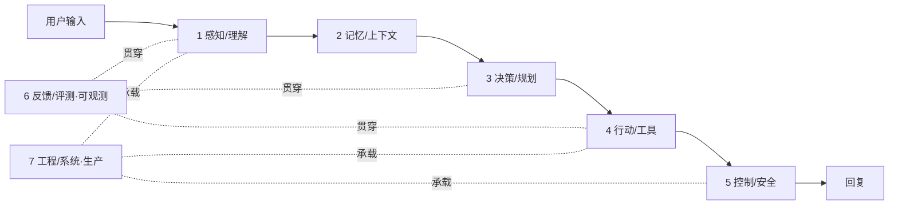

# Agent 工程知识体系地图

> 给碎片找骨架。**任何 Agent 知识点 / 八股 / 面经,都能归到下面 7 层之一。** 学新东西先定位层,再对比同层方案,再看自己项目怎么做——这就是举一反三。
>
> 本文是通用知识地图，不代表项目全部实现。项目学习请从
> [分模块学习路线](分模块学习路线.md) 开始。

## 怎么用这张图

1. **7 层是横轴**(系统解剖),**"一条消息生命周期"是纵轴**(数据怎么流过 7 层)。横纵一交叉,任何点都有坐标。
2. **每个知识点过"三问"**:① 解决什么问题(归哪层)② 有哪些方案+权衡(同层兄弟)③ 我项目用了哪个、为什么、何时换。
3. **以项目为骨架,八股为血肉**:本项目踩满 7 层 → 学到一个点就挂到对应层,记"我项目做了 X,备选是 Y/Z"。
4. **从"是什么"升到"为什么+什么时候"**:八股停在是什么;精通是权衡与场景。

---

## 层 1 · 感知/理解(输入 → 意图)

- **解决**:把用户一句话变成结构化意图/参数。
- **核心概念(八股)**:意图分类、槽位填充(slot filling)、实体抽取、query rewriting、NLU。
- **方案对比与权衡**:

| 方案 | 优 | 劣 | 何时用 |
|---|---|---|---|
| 规则/关键词 | 快·零成本·可控 | 脆、不懂否定/语义 | 高频明确句的快路 |
| 向量+kNN | 懂改写 | 需样例库 | 语义召回 |
| LLM 分类 | 懂否定/多轮/改写 | 成本/延迟·非确定 | 歧义/长尾 |
| 微调小模型(BERT) | 快·便宜·准 | 需标注数据+训练 | 有数据+高QPS |
| **级联(规则快路+LLM兜底)** | 兼顾 | — | **主流** |

- **本项目**:结构化意图(关键词召回 + 极性判定 + LLM-defer)、`IntentResult`。
- **面试常问**:意图怎么做?否定/多轮怎么处理?为什么不纯 LLM?→ 答:级联,规则快、LLM 兜底,confidence 驱动。

---

## 层 2 · 记忆/上下文(跨时间记什么)

- **解决**:agent 跨轮/跨会话记住什么、上下文怎么管。
- **核心概念**:短期(对话历史)、长期(偏好/画像)、情景记忆(episodic)、工作记忆、RAG 检索记忆、prompt 缓存、上下文窗口管理(截断/摘要)。
- **方案对比**:全量历史 vs 窗口截断 vs 滚动摘要 vs 向量按需召回;**客观事实查库 vs 存记忆**(查库防幻觉)。
- **本项目**:P1 对话记忆(窗口加载历史)、事实查 DB 不记忆、转人工摘要;上下文溢出降级(待办)。
- **面试常问**:记忆怎么做?长对话上下文爆了怎么办(截断/摘要/检索)?事实和记忆区别(查库 vs 记)?

---

## 层 3 · 决策/规划(选择做什么)

- **解决**:拿到理解后,决定调哪个能力、走几步、做/问/转人工。
- **核心概念**:意图路由、规划范式(**ReAct** 边想边做 / **Plan-and-Execute** 先规划后执行 / **Reflexion** 反思 / ToT)、工具选择、任务分解、多 Agent 编排、终止条件。
- **方案对比**:ReAct vs Plan-Execute vs 单步;单 Agent vs 多 Agent;迭代上限/何时停。
- **本项目**:Skill 路由、`plan` 声明、ReAct loop、**确认门**(决定要不要执行高危动作)、转人工条件。
- **面试常问**:ReAct 是什么?怎么决定调哪个工具?多步任务怎么规划?什么时候转人工?

---

## 层 4 · 行动/工具(与世界交互)

- **解决**:读取信息、执行动作(尤其写/不可逆)。
- **核心概念**:function/tool calling、工具 schema 设计、结果回灌、参数绑定、副作用/不可逆动作、MCP、并行工具调用。
- **方案对比**:LLM 自由填参 vs **服务端绑定关键参数**(安全);工具内直接写 vs **决策与写分离(finalize)**;同步 vs 异步工具。
- **本项目**:工具层(`ToolResult`+自动审计)、loop 回灌、**参数绑定防越权**、**finalize 确定性写(读写分离)**。
- **面试常问**:tool calling 原理?怎么防 LLM 乱传参/越权?不可逆动作(退款)怎么处理?→ 答:读写分离 + 参数绑定 + 确认门。

---

## 层 5 · 控制/安全/治理(别失控)

- **解决**:让 agent 安全、合规、不被绕过、不乱做。
- **核心概念**:guardrails(输入/输出)、**prompt 注入防御**、内容审核、鉴权/越权(IDOR)、动作幂等、二次确认、限流、PII/合规、域约束。
- **方案对比**:
  - 注入:检测(脆) vs **限制爆炸半径**(架构,正解)
  - 域约束:提示词(软) vs **架构硬闸**(硬)
  - 幂等:应用层键 vs DB 唯一约束 vs 分布式锁(**纵深防御,锁≠正确性,DB约束才是**)
- **本项目**:硬边界 guard 链、读写分离、参数绑定、guardrails、请求级幂等 + 确认门 + 最小 Bearer Token/RBAC。**缺口(能讲)**:企业 IAM/refresh/key rotation、内容审核。
- **面试常问**:prompt 注入怎么防?怎么保证不跑题?越权/幂等/动作安全?→ 答:架构限爆炸半径 + 硬闸 + 纵深幂等。

---

## 层 6 · 反馈/评测·可观测(知道好不好 + 改进)

- **解决**:量化质量、定位问题、持续改进(不靠感觉)。
- **核心概念**:评测集(合成/真实/对抗)、断言评测、**LLM-as-Judge**(盲评/参考锚定/自评偏好/可换模型)、回归、trace、指标、token/成本、A/B。
- **方案对比**:断言(流程对错) vs LLM-Judge(语义质量)——两层互补;离线评测 vs 线上监控;**没真实数据 → 合成评测集**。
- **本项目**:两层评测(断言 + LLM-Judge 可换模型)、trace_id、工具审计、token/成本、`--real` 验证。
- **面试常问**:没数据怎么评测 agent?怎么知道改好了(回归)?LLM-Judge 自评偏好怎么压?怎么排障?

---

## 层 7 · 工程/系统·生产(上生产、扛量、省钱)

- **解决**:异步承载、并发正确、扩展、部署、降本。
- **核心概念**:异步/队列削峰、系统级幂等、并发/**分布式锁**、扩展(多实例/读写分离/分库)、缓存、限流熔断、部署(容器/K8s/CICD)、provider 抽象/模型路由/降本、监控告警。
- **方案对比**:
  - 同步 vs **异步**(削峰)
  - 缓存:prompt 缓存 vs 响应缓存(**按场景判 ROI**,售后短对话多半不值)
  - 降本:**减少调用**(规则快路/确定性 finalize)> 缓存 > 模型路由
  - **单体 vs 微服务**(职责边界:agent 理解决策 / 退款服务执行+幂等+锁)
- **本项目**:异步队列+worker+轮询、provider 可插拔、PG 并发实测、数据分层;**单体(生产会拆,边界清楚)**。
- **面试常问**:QPS 上万怎么扛?成本怎么控?怎么部署?agent 和后端职责边界?

---

## 面试定位法(被问任何点的标准动作)

> **任何问题 → ① 定位它在哪层 → ② 讲这层的方案对比与权衡 → ③ 我项目选了哪个、为什么、什么场景换。**

例:"怎么防止重复退款?"
→ ①层5控制(幂等)+层7系统(并发/锁) → ②应用层键/DB约束/分布式锁,纵深防御,锁≠正确性 → ③我项目三层幂等+PG实测+会话级幂等;动账幂等归退款服务(单体里实现了,清楚边界)。

**这套"定位→权衡→我的选择",就是从背题到精通、能举一反三的标志。**

---

## 配套

- 项目逐层实现:`项目讲解.md`
- 每个决策的原因：[当前架构决策](../architecture/架构决策.md)
- 讲法与亮点：[项目亮点](../interview/项目亮点.md)
