# SupportFlow 项目全景讲解

> 用链路图 + 少量带注释核心代码,把项目从头讲清。既可自查复盘,也是面试讲述主线。
> 本文保留详细图解；当前事实以 [架构文档](../architecture/01-项目总览.md) 为准，
> 学习顺序以 [分模块学习路线](分模块学习路线.md) 为准。

本文重点讲解智能体主线。数据模型、运行器、认证、前端和部署的当前版本已经拆到
[十个架构模块](../README.md#当前架构模块)，不再用早期章节勾选状态表示项目完成度。

---

## 0. 定位 + 整体架构

**一句话**:一个把"退款"这类高危售后事务做到【安全、可控、可评测】的**有界 Agent**——LLM 当组件(只做理解/解释),不可逆决策由确定性代码把关。

**核心理念**:harness(AgentCore)统一跑执行管道,业务能力做成声明式 Skill 插件;LLM 只读,写操作与决策由 `finalize` 确定性执行。

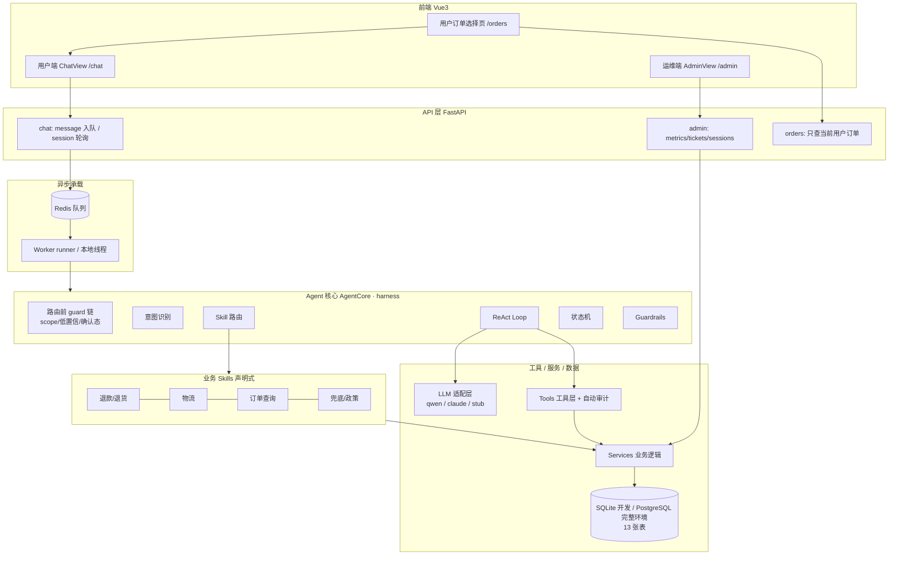

**分层职责**：
- **前端**：用户登录后先从本人订单中选择，再进入售后对话；运维端看指标、工单和会话。
- **接口层**：`POST /chat/message` 只落库+入队并立即返回；前端优先接收服务端事件流，断线时轮询。
- **异步**：Redis 队列 + Worker 消费(本地可切线程模式，无需 Redis)。削峰、可重试。
- **Agent 核心(harness)**：统一跑执行管道——guard 链 → 意图 → 路由 → loop → finalize → guardrails → 状态机。
- **Skills**：声明式业务插件，只声明"要什么工具(plan)"+"据结果给答复(finalize)"。
- **工具/服务/数据**：工具是对服务的封装(自动审计)，服务读写 DB；LLM 可插拔。

---

## 1. 一条消息的完整生命周期 ★主脊

先看全局：用户发一句话，到拿到回复，经历了什么。**关键是异步——发消息不阻塞，结果优先推送、轮询降级。**

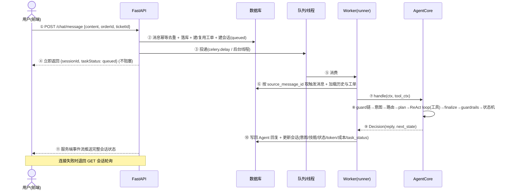

**为什么这么设计**：
- **②消息幂等**：同一 `clientMessageId` 只处理一次(防网络重试/狂点重复)——接入层第一道幂等。
- **③④ 入队即返回**：LLM 处理慢(秒级)，POST 不能阻塞用户。异步削峰：高峰期请求堆队列，Worker 按能力消费。
- **⑥ 加载历史 + 状态**：这就是 P1 对话记忆 + 跨轮确认态续接的入口(后面第 8 节细讲)。
- **⑧ 是核心**：所有 Agent 智能都在这一步，下面第 4 节逐步拆开。
- **⑪ 状态闭环**：前端获取任务状态、可审计执行时间线、工具记录和令牌成本。时间线不是模型隐藏思维。

> 记住这张图：**后面每一节(意图/路由/loop/工具/finalize)都是在放大第 ⑧ 步里的某一环。**

---

## 2. 意图识别

**什么是意图**：把用户一句话归到一个固定的意图类(枚举),如 `refund_request`/`logistics_query`/`out_of_scope`。它决定后面交给谁处理。

本项目意图识别是**两段式**:`关键词召回候选 → 极性判定 → 结构化结果`;召回不准时**带对话历史交 LLM** 兜底。

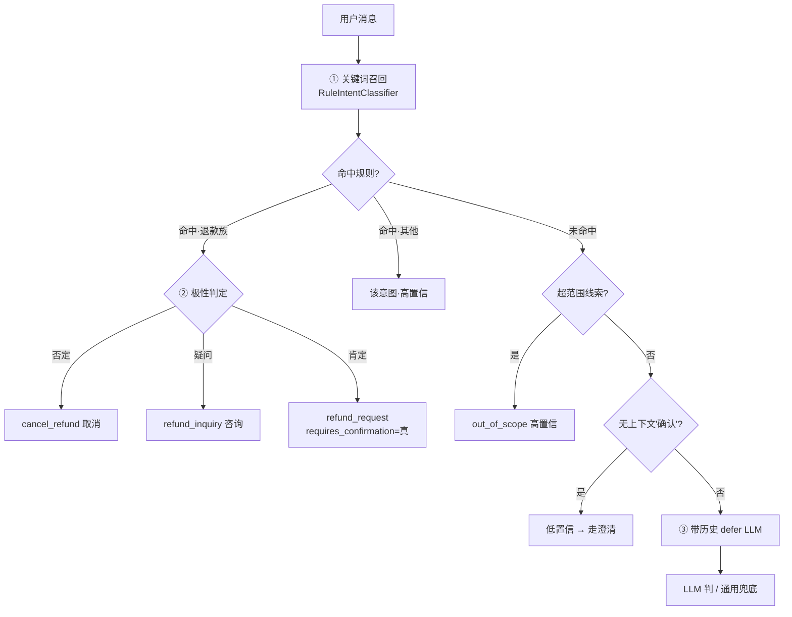

**四个关键点**:
1. **关键词只做"候选召回",不直接触发动作**(ADR-16)——命中"退款"≠用户要执行退款。
2. **退款族经极性才定意图**:否定→取消、疑问→咨询、肯定→请求(且标记需确认)。治了"我不想退款了""能退款吗"被误当退款。
3. **confidence 驱动行为**:低置信不进业务技能,统一走澄清。
4. **规则快路 + LLM 语义兜底**:规则覆盖不到的长尾(口语化)带对话历史交 LLM(ADR-18),不靠堆词表。

```python
@dataclass
class IntentResult:                 # 结构化意图——不只是一个标签
    intent: Intents                 # 意图(str-Enum，不散落字符串)
    polarity: Polarity              # 极性：肯定/否定/疑问/中性
    action_type: ActionType         # 动作：执行/查询/取消/确认/无
    confidence: Confidence          # 置信：high/medium/low(low→澄清)
    requires_confirmation: bool     # 是否需二次确认(高危写)
    reason: str

# classify_intent 节选：关键词只是候选，极性才决定退款族的最终意图
candidate, from_rule = self.rule.classify(text)        # ① 关键词召回候选
if from_rule and candidate in _REFUND_FAMILY:
    if is_neg:        # ② 否定优先:"我不想退款了" → 取消，不是退款
        return IntentResult(Intents.CANCEL_REFUND, Polarity.NEGATIVE, ActionType.CANCEL, ...)
    if is_q:          # ③ 疑问不算请求:"能退款吗" → 咨询
        return IntentResult(Intents.REFUND_INQUIRY, Polarity.INTERROGATIVE, ActionType.QUERY, ...)
    # ④ 肯定的退款 → 请求，但标记"需确认"(关键词不直接触发建草稿)
    return IntentResult(candidate, Polarity.POSITIVE, ActionType.EXECUTE,
                        Confidence.HIGH, requires_confirmation=True, reason="...")
```

---

## 3. 什么是路由

**路由 = 拿到意图后,决定交给哪个 Skill 处理。** `SkillRouter` 遍历注册的 Skill,谁的 `triggers` 包含该意图就交给谁,都不认领则落兜底 `GeneralSkill`。

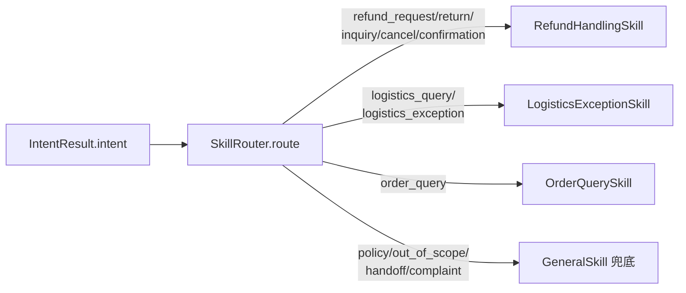

**关键点:一个 Skill 认领多个相关意图**(`triggers` 是集合)——退款族 5 个意图**共用** RefundHandlingSkill,不是"一意图一 Skill"。**独立业务域才单独成 Skill**(退款/物流/订单查询各一个)。

```python
class SkillRouter:
    def route(self, intent) -> Skill:
        for skill in self._skills:
            if intent in skill.triggers:    # 谁的触发集合包含该意图，就交给谁
                return skill
        return self._default                 # 都不认领 → 兜底 GeneralSkill

# 每个 Skill 用 triggers 声明"我管哪些意图"——多个相关意图共用一个 Skill
class RefundHandlingSkill:
    name = "refund_handling"
    triggers = {Intents.REFUND_REQUEST, Intents.RETURN_REQUEST, Intents.REFUND_INQUIRY,
                Intents.CANCEL_REFUND, Intents.REFUND_CONFIRMATION}
```

> 衔接：意图(第2节)→ 路由(本节)选出 Skill → 下一节看 AgentCore 怎么把 Skill 跑起来(plan → loop → finalize)。

---

## 4. Agent 执行管道 ★(放大主脊第⑧步)

`AgentCore.handle` 是整个 Agent 的心脏——所有智能都在这。它是一条固定管道:**guard 链 → 意图 → 路由 → plan → ReAct loop → finalize → guardrails → 状态机**。harness 统一跑,Skill 不自己跑 loop。

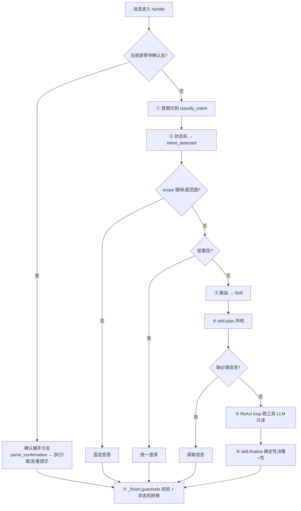

```python
def handle(self, ctx, tool_ctx=None) -> Decision:
    if ctx.state is None: ctx.state = States.CREATED

    # 确认握手轮：当前在等待确认态 → 专用 parser，不走通用分类(高危门 fail-safe)
    if ctx.state == States.WAITING_USER_CONFIRM:
        return self._handle_confirm(ctx, tool_ctx)

    # ① 意图识别(带对话历史)
    intent_result = self.classifier.classify_intent(ctx.message, history=ctx.history)
    ctx.intent, ctx.intent_result = intent_result.intent.value, intent_result
    ctx.state = self.sm.transition(ctx.state, States.INTENT_DETECTED)   # ② 状态机集中转移

    # —— 路由前 guard 链(确定性短路，不进业务技能)——
    if intent_result.intent == Intents.OUT_OF_SCOPE:                    # scope 硬闸
        return self._finish(ctx, Decision(_OUT_OF_SCOPE_REPLY, States.RESOLVED_BY_AGENT))
    if intent_result.confidence == Confidence.LOW:                     # 低置信澄清
        return self._finish(ctx, Decision(_CLARIFY_REPLY, States.INFO_REQUIRED, ...))

    # ③ 路由 → ④ plan(声明要什么工具/缺什么信息)
    skill = self.router.route(intent_result.intent); ctx.skill = skill.name
    plan = skill.plan(ctx)
    if plan.required_info:                                             # 缺信息→索取，短路 loop
        decision = Decision("请补充：" + "、".join(plan.required_info), States.INFO_REQUIRED, ...)
    else:
        self._run_loop(ctx, plan, tool_ctx)        # ⑤ harness 统一跑 ReAct loop(LLM 只读)
        decision = skill.finalize(ctx, tool_ctx)   # ⑥ Skill 据结果确定性决策+写
    return self._finish(ctx, decision)

def _finish(self, ctx, decision):                  # ⑦ 收尾:护栏 + 状态机(绝不绕过)
    decision.reply = self.guardrails.postcheck(decision.reply)
    ctx.state = self.sm.transition(ctx.state, decision.next_state)
    return decision
```

**为什么这么设计**:
- **guard 链在路由前**:超范围/低置信/确认态在进业务技能**之前**就确定性短路——域约束靠架构不靠提示词(层5)。
- **loop 归 harness 统一跑**:不散落各 Skill,guardrails/状态机/token 记账集中一处。
- **状态机集中转移**:只在 ②④⑦ 转,Skill 只声明 `next_state`,非法转移抛异常。
- **finalize 确定性**:不可逆决策/写在这,不交给 LLM(层4 读写分离)。

---

## 5. Skill 是什么(声明式业务插件)

Skill 只做两件事,**不自己跑 loop**:
- **`plan(ctx)`** —— 声明"怎么做":系统提示 + **工具白名单** + 缺什么信息。loop 之前,只声明不执行。
- **`finalize(ctx, tool_ctx)`** —— loop 之后,据结果产出 `Decision(回复, 下一状态)`,**确定性写操作在这**。

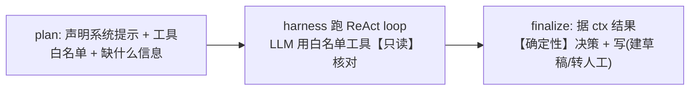

```python
class RefundHandlingSkill:
    name = "refund_handling"
    triggers = {Intents.REFUND_REQUEST, Intents.RETURN_REQUEST, Intents.REFUND_INQUIRY,
                Intents.CANCEL_REFUND, Intents.REFUND_CONFIRMATION}

    def plan(self, ctx):                                   # 只声明:不执行
        if ctx.order_id is None:
            return SkillPlan(_SYSTEM, allowed_tools=[], required_info=["订单号"])  # 缺单号→索取
        return SkillPlan(_SYSTEM, allowed_tools=_READ_TOOLS, max_iterations=4)      # 给【只读】工具

    def finalize(self, ctx, tool_ctx):                     # loop 之后:确定性决策 + 写
        db = tool_ctx.db
        policy = refund_service.check_refund_policy(db, ctx.order_id, ctx.user_id, ctx.message)
        if not policy["eligible"]: ...                     # 不可退 → 转人工
        if refund_service.get_active_refund(db, ...): ...  # 会话级幂等:已有则不重复
        if policy["require_human_approval"]:               # 高风险 → 直接转人工 + 建工单
            ...
        # 低风险 → 不直接建草稿，先存 pending_action + 转【待确认】(高危二次确认门)
        ticket.pending_action = {"id": action_id, "type": intent, "order_id": ctx.order_id, ...}
        return Decision("该订单可以申请退款，请在下方确认是否提交。", States.WAITING_USER_CONFIRM)
```

**为什么 Skill 这样设计**:
- **声明式 + harness 跑**:加一个业务能力 = 加一个 Skill(写 plan+finalize),不动 harness——可插拔。
- **读写分离落点**:loop 里 LLM 只用白名单**只读**工具核对;退款的**决策与写在 finalize**,确定性、可控。
- **多意图共用**:`triggers` 一个集合认领退款族 5 个意图,finalize 内按意图分支(请求/确认/取消/咨询)。

> 衔接:plan 声明了"要哪些工具",下一节看 **harness 怎么跑 ReAct loop 真正调这些工具**(第 6 节)。

---

## 6. 工具调用(ReAct loop 怎么跑)

`plan` 声明了工具白名单后,harness 的 `_run_loop` 真正跑 ReAct 循环:**问 LLM → 它要调工具就执行、把结果回灌 → 再问 → 直到它说"不用工具了"。**

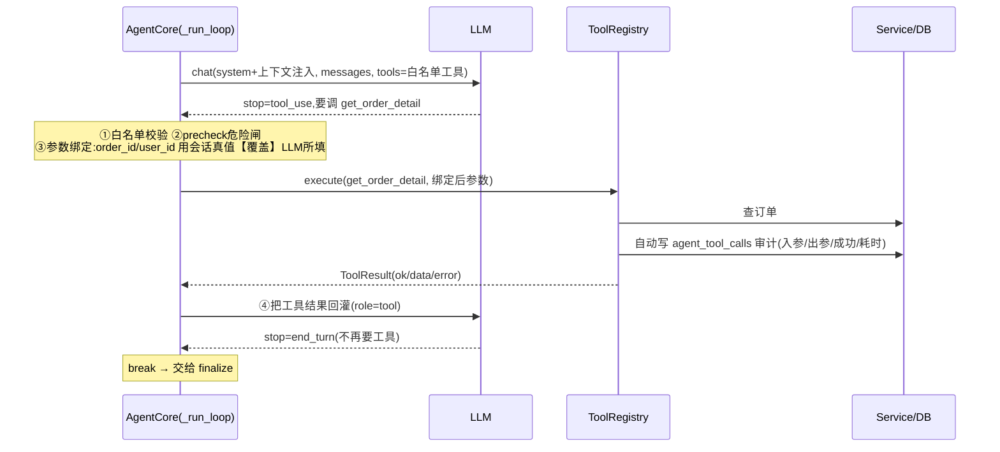

```python
def _exec_tool(self, ctx, tool_ctx, allowed, tc):
    if tc.name not in allowed:              # ① 白名单外拒绝(防 LLM 越权调工具)
        return err("tool_not_allowed", ...)
    self.guardrails.precheck(tc.name, tc.arguments)             # ② 危险动作闸门
    args = self._bind_context_args(ctx, tc.name, tc.arguments)  # ③ 参数绑定:防越权(IDOR)
    result, record = self.tools.execute(tool_ctx, tc.name, args)  # 执行+自动审计(写 agent_tool_calls)
    ctx.tool_call_records.append(record)
    return result

def _bind_context_args(self, ctx, name, args):     # 关键值不信 LLM，用会话真值覆盖
    bound = dict(args or {})
    props = self.tools.schema_props(name)
    if "user_id" in props:  bound["user_id"] = ctx.user_id      # 强制会话用户 → 防查他人
    if "order_id" in props and ctx.order_id:  bound["order_id"] = ctx.order_id
    return bound
```

**为什么这么设计**:
- **白名单**:LLM 只能调 `plan.allowed_tools` 内的工具(防越权调用)。
- **参数绑定**:`user_id/order_id` 服务端用会话真值**覆盖** LLM 所填——LLM 被诱导传他人 id 也无效(防 IDOR)。
- **结果结构化 + 不崩**:工具返回 `ToolResult{ok,data,error}`,失败不抛、不崩主流程。
- **自动审计**:每次调用经 `ToolRegistry.execute` 自动写 `agent_tool_calls`(入参/出参/成功/耗时)——可观测来源。
- **迭代上限**:`max_iterations` 防 LLM 反复调工具死循环。
- **关键**:loop 里 LLM 只**只读**(查订单/政策);退款的**写**不在 loop,在 finalize(读写分离)。

---

## 7. 退款/退货确认流（操作卡片 + 状态机 + pending_action）

退款、退货不能一句话就提交。第 1 轮保存待执行动作并展示操作卡片；用户第一次点击确认后，
前端只展示订单、商品和金额，第二次点击「确认提交」才调用结构化操作接口。
取消是安全操作，一次点击即可。`pending_action` 保存在工单中，负责绑定具体动作并跨轮续接。

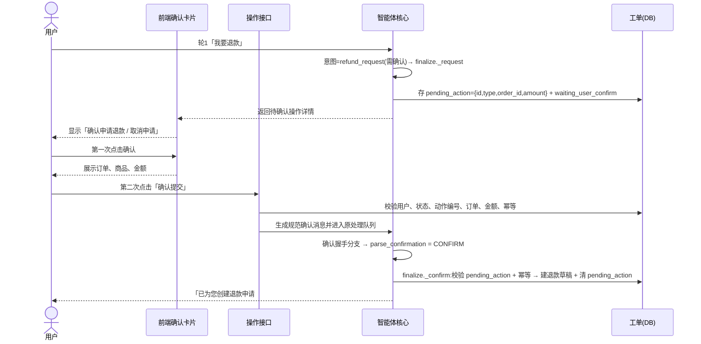

涉及的状态机(子集):
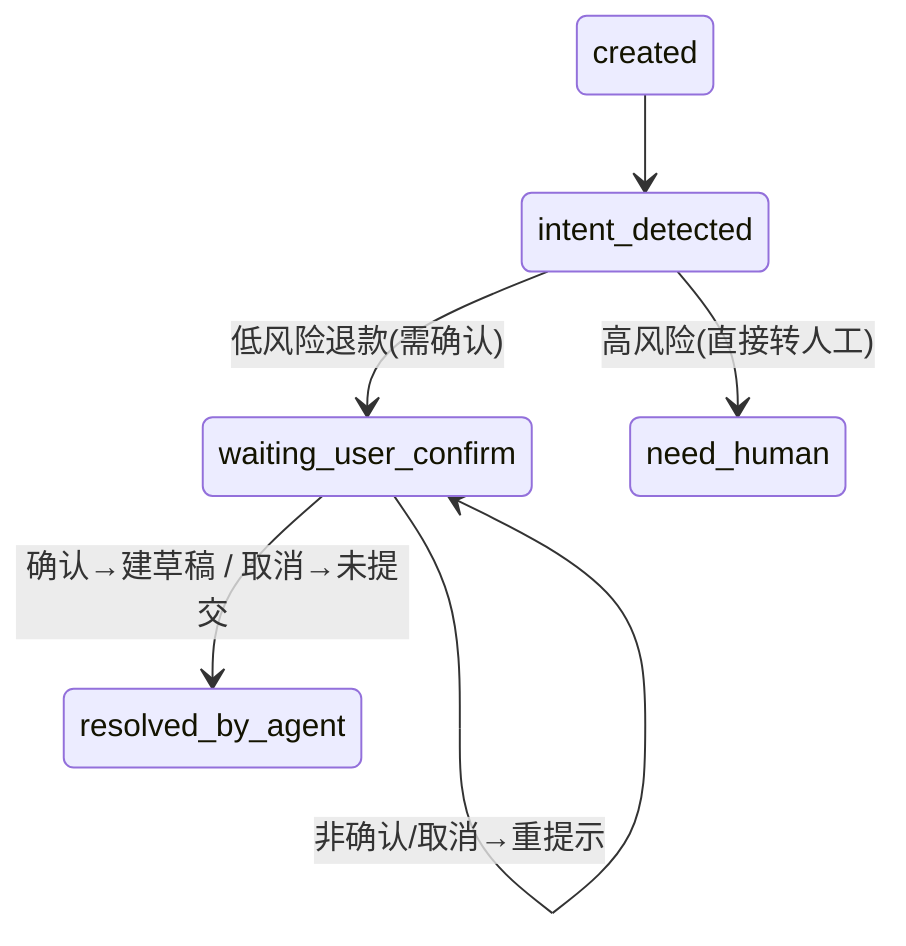

```python
# 确认握手分支:专用 parser(强确认/强取消/迟疑→保持等待，fail-safe)
def _handle_confirm(self, ctx, tool_ctx):
    sig = parse_confirmation(ctx.message)
    if sig == ConfirmSignal.UNCLEAR:        # "不确定"等 → 不执行，重提示
        return self._finish(ctx, Decision("请回复 确认 / 取消。", States.WAITING_USER_CONFIRM))
    intent = Intents.REFUND_CONFIRMATION if sig == ConfirmSignal.CONFIRM else Intents.CANCEL_REFUND
    ctx.intent_result = IntentResult(intent, ...)
    skill = self.router.route(intent); plan = skill.plan(ctx)
    self._run_loop(ctx, plan, tool_ctx)
    return self._finish(ctx, skill.finalize(ctx, tool_ctx))

# 操作接口先校验归属、工单状态、动作编号、订单和金额，再进入原确认处理链路。
# finalize 里的确认分支继续负责幂等和确定性写入。
def _confirm(self, db, ctx, ticket):
    pa = ticket.pending_action
    if not pa or pa["type"] not in ("refund_request", "return_request"):
        return Decision("当前没有待确认的申请。", States.RESOLVED_BY_AGENT)
    if refund_service.get_active_refund(db, ctx.user_id, pa["order_id"]):  # 幂等
        ticket.pending_action = None
        return Decision("该退款已在处理中。", States.RESOLVED_BY_AGENT)
    draft = refund_service.create_refund_draft(db, user_id=ctx.user_id, order_id=pa["order_id"], ...)
    ticket.pending_action = None                   # 清掉待确认动作
    return Decision(f"已为您创建退款申请 #{draft['refund_request_id']}。", States.RESOLVED_BY_AGENT)
```

**为什么这么设计**:
- **两次点击确认**：第一次只展示详情，第二次才请求后端，防止误触。
- **结构化操作**：按钮提交 `actionId + decision`，不是让前端伪造“确认”文本。
- **pending_action 绑定具体动作**：同时绑定操作类型、订单、金额和动作编号，防跨业务误确认。
- **跨轮靠工单状态 + runner**:轮1 把工单置 `waiting_user_confirm`,轮2 runner 读到它就续接确认态(下一节记忆细讲)。
- **fail-safe**:"不确定"等迟疑 → 不执行、重提示;强确认才建草稿。

> 衔接:确认流依赖"轮2 能读到轮1 的状态" —— 这就是 runner 的跨轮加载,下一节(记忆)讲。

---

## 8. 记忆(对话历史加载 + 跨轮状态续接 + 转人工摘要)

Agent 的"记忆"分三件,**各管一段、各有边界**:进 loop 前 runner 加载历史与续接状态,转人工那一刻打包摘要交接。核心原则(ADR-21):**客观事实查库、不记忆;对话/叙述才进记忆**。

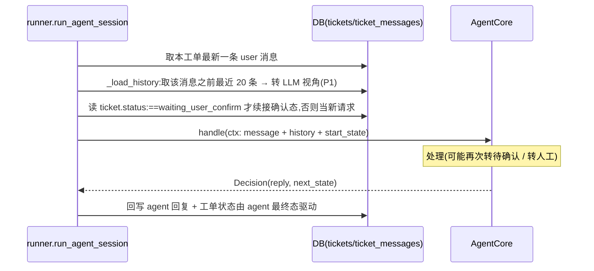

```python
# ① P1 短期对话记忆:按"条数"窗口截断(控 token),只取当前消息之前的历史
_HISTORY_MAX_MSGS = 20
def _load_history(db, ticket_id, before_id):
    rows = db.scalars(select(TicketMessage).where(
        TicketMessage.ticket_id == ticket_id,
        TicketMessage.id < before_id).order_by(TicketMessage.id)).all()
    rows = list(rows)[-_HISTORY_MAX_MSGS:]                  # 末尾 N 条
    return [Msg(role=_ROLE_MAP.get(m.sender_type, "user"), content=m.content) for m in rows]
    # 人工/agent 都映射成 assistant 侧,user 侧保持 user

# ② 跨轮状态续接:只有"等待确认"态需续接,其余新消息一律从 CREATED 起(视为新请求)
start_state = (States.WAITING_USER_CONFIRM
               if ticket.status == States.WAITING_USER_CONFIRM else None)
ctx = AgentContext(..., message=msg.content, order_id=ticket.order_id,
                   state=start_state, history=_load_history(db, ticket_id, msg.id))
```

转人工时，`handoff_service` 会把上下文打包给人工客服——**事实查库、叙述靠模型或模板**：

```python
def summarize_for_human(db, ticket_id, llm=None):
    # ③ 事实字段:确定性从 DB 取(订单/退款/原因)——绝不让 LLM 编造数字
    order_info  = f"{o.order_no}（{status_cn}，{o.total_amount} 元）"      # 查 orders
    refund_info = f"退款单 #{refund.id}（{refund.status}，{refund.amount} 元）"  # 查 refund_requests
    # ④ 叙述字段:分档 + LLM/模板 + 失败降级
    #    ≤3 条→不总结直接给原文;有 llm→LLM 概括(prompt 强约束"不得编造订单号/金额");
    #    llm=None 或异常→回退模板("共 N 条往来;用户最近诉求:…")
    brief, source = _narrative(msgs, user_msgs, llm)
    return {"user_need": ..., "handoff_reason": _derive_reason(t, refund),
            "order_info": order_info, "refund_info": refund_info,
            "conversation_brief": brief, "generated_by": source}  # 展示在 /admin/tickets/{id}
```

**为什么这么设计**:
- **事实查库、不记忆**(ADR-21):让 LLM 把订单/金额"记"进记忆 = 引入幻觉与可篡改风险。真实数据在表里,应**查**不应**记**;冲突时信 DB。
- **只续接"等待确认"态**:其余新消息当新请求从 `CREATED` 起,避免旧状态污染新意图;确认态必须续接,否则轮 2 的"确认"无处落地(承接第 7 节)。
- **窗口控 token**:P1 按条数(20)截断,够用且便宜;按 token 精确截断 / 滚动摘要留待上下文真变长或上 RAG 时(与转人工摘要同一套机制,合并做)。
- **摘要也守读写分离**:数字事实由代码填(一定对),诉求/经过由 LLM 写;**失败必降级**(回退模板/原文),绝不阻断转人工。短对话直接给原文(总结 2 句没意义还可能失真)。

---

## 9. 评测(两层 + LLM-as-Judge)

只看 demo 说不清好坏。评测分**两层**:**第一层代码断言**判"流程对不对"(可复现),**第二层 LLM-Judge** 判"答得好不好"(语义)。两层都默认 stub 可复现,`--real` / `--judge-real` 切真实模型。

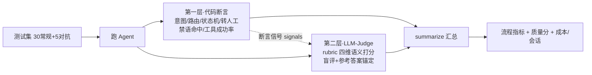

```python
# 一条 case 跑两层:第一层产 signals(断言),第二层据 reply 打分
r = {"intent_ok": view.current_intent in accept_intents,   # 第一层:流程断言
     "skill_ok": ..., "state_ok": ..., "handoff_ok": ...,
     "forbidden_hits": hits, "tool_calls_ok": ..., "cost": ...}
r["judge"] = judge.score(c, reply, r)        # 第二层:LLM-Judge(stub 据 signals 折算 / real 读 reply 语义评)
```

第二层裁判的关键设计(`judge.py`):
```python
DIMENSIONS = ("accuracy", "helpfulness", "compliance", "tone")   # rubric 四维,固定→可跨次回归
_JUDGE_SYSTEM = "你是电商售后质检专家…仅依据【用户问题】【期望表现】【Agent回复】评分,不要臆测由哪个模型生成"
#  ↑ 业务背景"该给"(评得准);生产者身份"该藏"(盲评,评得公)

def build_judge(real=False):
    if real:
        judge_model = get_settings().judge_model or None     # 设 JUDGE_MODEL 可换更强/异源模型
        return LLMJudge(build_llm_client(model=judge_model))  # 压制自评偏好
    return StubJudge()        # 据第一层断言信号确定性折算 → CI 可复现、零成本
```

汇总指标(`metrics.summarize`,分三类):
| 类别 | 指标 | 说明 |
|---|---|---|
| 流程 | intent / skill_routing / state_transition / handoff accuracy、tool_call_success_rate | 断言派生,可复现 |
| 质量(断言) | policy_compliance、**forbidden_phrase_block**、**high_risk_handoff** | 对抗用例上单独算 |
| 质量(Judge) | judge_overall + 四维 + **judge_parse_fail_rate** | 第二层语义分 + 裁判自身健康度 |
| 成本 | average_tokens / average_cost per session | 折算真实 usage |

实测(qwen-plus,裁判 qwen-max):流程指标全 1.0、对抗全拦、Judge 综合 **4.57/5**。

**为什么这么设计**:
- **两层互补**:断言只判流程对不对,判不了回复好不好;Judge 补语义,还能**定位短板**——实测就是 Judge 指出订单查询 helpfulness 垫底,才催生了 `OrderQuerySkill`。
- **裁判可换模型**:`JUDGE_MODEL` 同 provider 换更强模型当裁判,压制"自己给自己打高分"的自评偏好;盲评 + 参考答案锚定进一步降方差。
- **stub/real 双实现**:stub 据断言信号折算质量分,不调 API → CI 每次跑都稳定可复现;`--real` 才烧 token 做真实语义评。
- **诚实标注代理指标**:`resolution_rate` 偏低≠质量差——"该转人工/该追问"的 case 本就不该 resolved;真正质量看 Judge,这点在代码注释里写明,不拿代理指标충数。

> 至此 0-9 节:架构 → 主脊 → 意图 → 路由 → 执行管道 → Skill → 工具调用 → 确认流 → 记忆 → 评测,核心链路 + 工程化(可观测/可评测/可复现)全齐。

---

## 10. 部署 · 可观测 · 降级(让它跑得起、看得见、不轻易崩)

业务链路之外,工程化的三件事:**一条命令拉起全栈、运行时看得见、任一依赖抖动不连坐崩**。

### 10.1 部署:一条命令拉起四件套

`docker compose -f deploy/docker-compose.yml up --build` 拉起 **db(PG16) + redis + api + worker**,api/worker **共用一个镜像**(同 `Dockerfile`,worker 在 compose 里覆盖 `command`)。

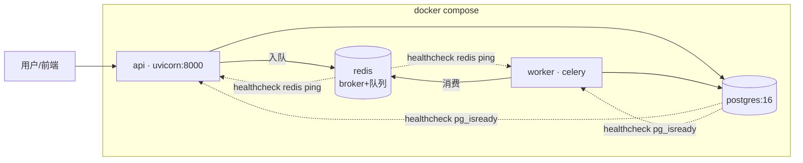

```yaml
# 关键:依赖就绪才起 api/worker —— 避免连不上 DB/Redis 的启动竞态
api:
  depends_on:
    db:    { condition: service_healthy }   # 等 pg_isready 通过
    redis: { condition: service_healthy }   # 等 redis ping 通过
worker:
  command: celery -A app.workers.celery_app.celery_app worker --loglevel=info
```

> **ADR-3**:部署只做本地 docker-compose——本地能完整演示 + 压测就够,上云增量价值低。Dockerfile/compose 按"可上云"方式写(uv 装依赖 + 层缓存 + 镜像复用),但不实际上云。

### 10.2 可观测:trace 串链路 + 一套指标两用

```python
# ① 全链路 trace_id:每会话生成,经 contextvar 贯穿所有日志(无侵入)
def run_agent_session(db, session_id, ...):
    new_trace_id()          # 本次会话唯一 id → contextvar
    ...
# TraceFilter 给每条日志注入 [trace_id] → 一次会话的意图/路由/工具/结果全串得起来

# ② /admin/metrics:压测削峰观测 + 管理端 dashboard 一套两用(ADR-12)
def compute_metrics(db) -> dict:
    return {
      "sessions_by_task_status": {...},      # 状态分布(queued/processing/completed/need_human/failed…)
      "queue_depth": _queue_depth(),         # Redis LLEN("celery") —— 削峰可视化的核心
      "agent": {"resolution_rate", "handoff_rate", "tool_call_success_rate", "avg_processing_ms"},
      "cost": {"total_tokens", "total_cost", "avg_tokens_per_session"},   # 折算真实 usage
    }
```

观测数据**不靠额外埋点**:工具调用审计来自第 6 节的 `agent_tool_calls`(自动落库),token/成本来自 runner 回写的 `agent_sessions`,队列深度直接读 Redis。一套接口既给 Locust 压测看削峰,又给管理端 dashboard 用。

### 10.3 降级:任一依赖抖动不连坐崩

```python
# ① Redis 不可达 → 探针/指标降级返回,不抛(健康检查仍出 JSON,只是标 degraded)
def _queue_depth():
    try: return int(redis_client.llen("celery"))
    except Exception: return None        # 队列深度拿不到 → None,不连累整个 metrics 接口

# ② /health 组件级探活:任一 down → 整体 degraded + 503(给编排做就绪探针),进程本身不崩
components = {"db": up/down, "redis": up/down}; 全 up 才 200,否则 503

# ③ worker 削峰 + 重试 + 超时(celery 配置)
task_acks_late=True            # 执行完才 ack → 进程崩溃任务可重投,不丢
worker_prefetch_multiplier=1   # LLM 任务重,限预取 → 平滑削峰,不让单 worker 囤一堆
task_soft_time_limit=100/120   # 软/硬超时 → 卡死的任务能被打断
# agent_tasks: max_retries=2 + 退避;runner 失败标 failed、超时单独标 timeout + retry_count++
```

**为什么这么设计**:
- **依赖就绪门(healthcheck + depends_on)**:避免 api/worker 先于 DB/Redis 起来的启动竞态——容器编排里最常见的"刚拉起就报连接错"。
- **trace_id 贯穿**:异步链路(API 入队 → worker 处理)跨进程,没有 trace_id 排查就得靠猜;contextvar + 日志 Filter 零侵入串起一次会话全程。
- **一套指标两用(ADR-12)**:运行时指标和压测观测本就是同一组数据,接口一套两用省一半活;`queue_depth` 让"削峰"从口号变成可看的曲线。
- **fail-open 而非 fail-closed**:Redis 抖动时探针/指标**降级返回**(None / degraded)而不是抛异常连坐——可观测组件挂了不该把主流程也带崩(呼应 ADR-4:Redis 只做非正确性职责)。
- **worker 三道保险**:`acks_late` 防丢(崩溃重投)、`prefetch=1` 削峰(不囤积)、`soft/hard timeout` + 有限重试防卡死;失败任务**留痕 failed/timeout + retry_count**(可观测、可追),而不是静默消失。

> 衔接：这一节把“业务正确”升级到“工程可用”。当前并发、上下文溢出与降级状态见
> [项目状态](../architecture/项目状态.md)，不要沿用本文早期里程碑口径。
